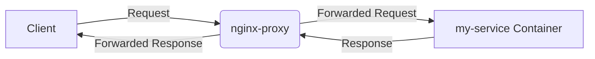

# An Overview of Reverse Proxies and Their Usage in Our Infrastructure

A reverse proxy is a type of server that retrieves resources on behalf of a client from one or more servers. These resources are then returned to the client as though they originated from the reverse proxy itself. 

In our infrastructure, we use `nginx-proxy`, a Docker container running Nginx and `docker-gen`. `docker-gen` generates reverse proxy configurations for Nginx and reloads Nginx when containers are started and stopped. This setup allows us to route incoming requests to different Docker containers (our services), each possibly running a different application, all on the same host machine.

Here's how it works:

1. A client makes a request to a certain URL, e.g., `https://my-service.braingeneers.gi.ucsc.edu`.
2. This request hits our server where the `nginx-proxy` is running.
3. The `nginx-proxy` checks its configuration and sees that requests to this URL should be routed to the `my-service` Docker container.
4. The `nginx-proxy` forwards the client's request to the `my-service` container.
5. The `my-service` container processes the request and sends a response back to the `nginx-proxy`.
6. The `nginx-proxy` sends this response back to the client.

This approach allows us to have a single point of entry (the `nginx-proxy`) for all incoming requests, simplifying our network configuration, and providing an easy way to add SSL support (via Let's Encrypt) and other features. 

The following is a basic flow diagram of this process:



# How to Add a New Service to the Nginx Reverse Proxy Configuration

This document will guide you on how to add a new service to our existing nginx-proxy configuration managed with Docker Compose.

## Procedure

    Clone the Repository: Clone the mission_control repository where our Docker Compose configuration resides.

```bash
git clone https://github.com/Braingeneers/mission_control.git
```

1. Edit the Docker Compose file: Open the docker-compose.yml file located in the mission_control directory in a text editor.
2. Add a new service: Under the services section, add a new service definition for your container. A typical service definition looks like this:

```yaml
  # Replace 'my-service' with the name of your service
  my-service:
    # Replace 'my-service-image' with the Docker image your service will use
    image: my-service-image
    # Expose the necessary port(s) your service uses. Replace '8000' with your port number
    expose: 
      - "8000"
    networks:
      - braingeneers-net
    environment:
      # Replace 'my-service' with your service's desired subdomain
      - VIRTUAL_HOST=my-service.braingeneers.gi.ucsc.edu
      # Replace 'my-service' with your service's desired subdomain
      - LETSENCRYPT_HOST=my-service.braingeneers.gi.ucsc.edu
      # Replace 'example@email.com' with your email address
      - LETSENCRYPT_EMAIL=example@email.com
```

3. Save and exit: Save the docker-compose.yml file and exit the text editor.
4. Restart the Docker Compose stack: Run the following command in the directory where your docker-compose.yml file is located:
```bash
docker compose up -d
```

This will stop and recreate the services defined in the Docker Compose file, including your newly added service.

5. Commit changes: After verifying your service works correctly, commit the changes to the docker-compose.yml file back to the mission_control repository.

```bash
git commit -am "Added my-service to Docker Compose configuration"
git push
```

## Important Notes

- VIRTUAL_HOST: The VIRTUAL_HOST environment variable in your service's definition determines the subdomain your service will be accessible from.
- Accessing Your Service: Your service will be accessible from https://my-service.braingeneers.gi.ucsc.edu, where my-service should be replaced with the name you used for the VIRTUAL_HOST.
- Stateless services: Aim to keep services as stateless as possible. While some caching on the local system is acceptable (like we do with the Let's Encrypt certificates), ensure that a clean start is always possible. If your service requires persistent storage, use our standard S3 bucket and implement logic in your service to handle fetching and storing data to/from the S3 bucket as needed.
- Clean start: Always verify that your service can start cleanly, without any dependencies on existing state or local cache. This ensures our setup is maintainable and reduces potential issues when moving or rebuilding servers.
