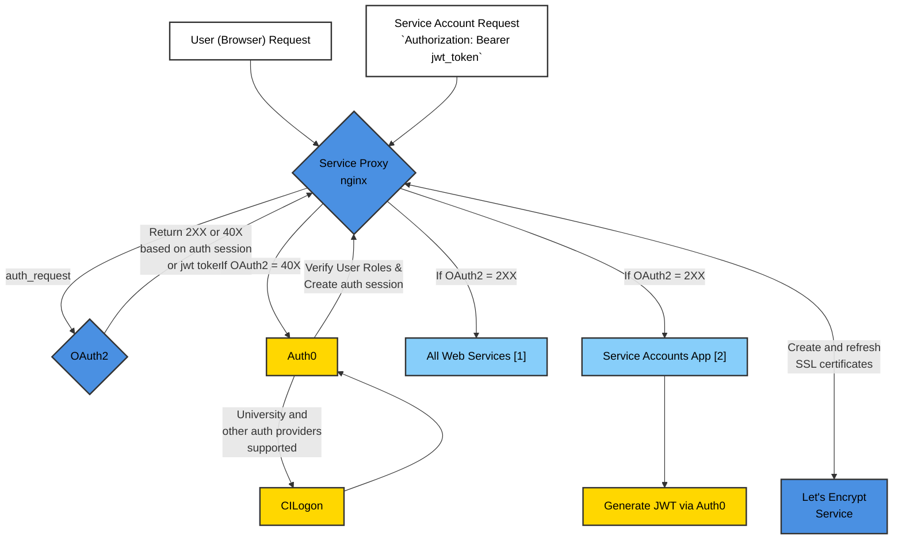

# Adding and maintaining web (and other) services in `braingeneers` infrastructure

## Basic usage:
Prerequisite: 
1. Log into our server: `braingeneers.gi.ucsc.edu`, see the [permissions page](https://github.com/braingeneers/wiki/blob/main/shared/permissions.md)
for access, then clone the repo into your home directory on `braingeneers` server as shown below.
2. Copy the NRP Kubernetes config file for service accounts to your home directory under `~/.kube/config`. [Download config file here](https://service-accounts.braingeneers.gi.ucsc.edu/static/config). This file allows the services to access our namespace secrets, which is where we store all our credentials files.

```bash
# clone the repo
> git clone git@github.com:braingeneers/mission_control.git
> cd mission_control
```

## Manage individual services

You can also start and stop a single services, this is the normal case so you don't 
interfere with other running services, it's perfectly safe to do this while other services are running:

The name `my_service` is defined in the `docker-compose.yaml` file under `services:`
for example `mqtt`, `slack-bridge`, etc. are services in the `docker-compose.yaml` file 

```bash
# Stop (remove) a specific service
docker compose rm -sf my_service

# Pull the latest image for a specific service
docker compose pull my_service

# Start a specific service in the background (removed -d, detached, to see logs in the foreground, useful during testing)
docker compose up -d my_service

# See a list of all braingeneers service names (these are defined in the docker-compose.yaml file but can be quickly listed with a double tab)
docker compose up -d <tab><tab>

# See logs for a specific service
docker compose logs my_service

# See process status for all services
docker compose ps
```

## Managing all services

This should only be done when the server is rebooted, under normal conditions you will be managing individual services as describe above.

```bash
# Pull latest version of all services
docker compose pull

# Start all services
docker compose up -d

# Stop all services
docker compose down
``` 

## How to Add a New Service

### Step 1: Clone the Repository

Clone the `mission_control` repo where our Docker Compose configuration resides (this command assumes GitHub SSH clone).

```bash
git clone git@github.com:braingeneers/mission_control.git
cd mission_control
```

### Step 2: Edit the Docker Compose File

Open the `docker-compose.yaml` file located in the `mission_control` directory in a text editor.

#### Adding a New Service

Add a new service definition for your container under the `services` section, similar to the existing services. Here is an example service you can start with:

```yaml
  # Describe your service in comments and let other people know who manages it
  your-service:                                                 # give your service a meaningful name, replace "your-service" with something meaningful like "supervisualizer"
    image: jwilder/whoami:latest                                # your docker image name as hosted on Docker Hub (or other image hosting service)
    expose:
      - "8000"                                                  # the port(s) that your service is listening on inside your container
    environment:
      VIRTUAL_HOST: "your-service.braingeneers.gi.ucsc.edu"     # choose an appropriate domain name for your service, for example: your-service.braingeneers.gi.ucsc.edu
      VIRTUAL_PORT: "8000"                                      # same as what you listed in expose
      LETSENCRYPT_HOST: "your-service.braingeneers.gi.ucsc.edu" # same as VIRTUAL_HOST
      LETSENCRYPT_EMAIL: "braingeneers-admins-group@ucsc.edu"   # don't change this
    networks:
      - braingeneers-net                                        # don't change this
```

#### Setting the Virtual Host and LetsEncrypt environment variables

The `VIRTUAL_HOST` & `LETSENCRYPT_HOST` environment variables in your service's definition determine the subdomain your service will be accessible from. For instance, if `VIRTUAL_HOST` is set to `your-service`. Your service will be accessible from `https://your-service.braingeneers.gi.ucsc.edu`. You can choose any valid hostname under the `braingeneers.gi.ucsc.edu domain`. The `VIRTUAL_PORT` defines what port(s) your service listens to. Your service can listen on any port, this is only used internally between the frontend nginx web server and your service.

### Configuring Shared Secrets

**IMPORTANT** Never include credentials in your docker image, that image is public and those credentials will be found and stolen if you do. Credentials are stored in our `braingeneers` namespace in Kubernetes. See the [administration page on the wiki](https://github.com/braingeneers/wiki/blob/main/shared/administrators.md) for more details.

If your service requires access to shared secrets such as the S3 credentials, add a volume mount from the shared secrets volume. The secrets will be available in the following directory structure. All secrets in our namespace are downloaded by the `secret-fetcher` service. If you've added a new secret to the Kubernetes namespace you can simply restart the `secret-fetcher` service to make it available and watch the `secret-fetcher` logs to confirm your new secret was pulled.

```text
/secrets/
  ├── prp-s3-credentials/
  │   └── credentials
  └── other-k8s-secret/
      └── other-files
```

You can add the following to your yaml to add this volume, you will see other services in the yaml that use this structure:

```
    volumes:
      - secrets:/secrets
    depends_on:
      secret-fetcher:
        condition: service_healthy
```

#### Using entrypoint-secrets-setup.sh

This is an advanced option.

The `entrypoint-secrets-setup.sh` script wraps the original entrypoint and allows copying files from the dynamic secrets volume to the correct location, as well as exporting environment variables from a specified file. Include this script in the service definition as shown in the example below if you need credentials files moved to the proper location, or environment variables set before launching your process.

Note the use of one or more `--copy` (or `--env`) commands which are processed 
by `entrypoint-secrets-setup.sh` to copy files to the correct location. 
You may use the `--env` option followed by the path to an 
environment file to export variables defined within that file into the 
environment.

Example of `--env` usage:

```bash
--env /secrets/k8s-secret-name/mysecrets.env
```

The above line will export all key-value pairs 
defined in `/secrets/k8s-secret-name/mysecrets.env` as environment 
variables, excluding lines starting with `#`. See the [wiki permissions page](https://github.com/braingeneers/wiki/blob/main/shared/permissions.md) 
on how to maintain kubernetes namespace secrets.

After processing the --copy and --env options, your original entrypoint command is executed with its arguments.

```yaml
services:
  your-service:
    image: your-image:latest
    entrypoint: /secrets/entrypoint-secrets-setup.sh
    command:
      - "--copy"
      - "/secrets/prp-s3-credentials/credentials:/root/.aws/credentials"
      - "--copy"
      - "/secrets/other-k8s-secret/another-file:/path/to/another-file"
      - "--env"
      - "/secrets/k8s-secret-name/mysecrets.env"
      - "original-entrypoint-command"
      - "arg1"
      - "arg2"
    environment:
      VIRTUAL_HOST: "your-service.braingeneers.gi.ucsc.edu"
      VIRTUAL_PORT: "8000"
      LETSENCRYPT_HOST: "your-service.braingeneers.gi.ucsc.edu"
      LETSENCRYPT_EMAIL: "braingeneers-admins-group@ucsc.edu"

    # This section adds the secrets volume to your service, secrets are stored in-memory so they must depend on the
    # secret-fetcher service which populates that volume at startup.
    volumes:
      - secrets:/secrets
    depends_on:
      secret-fetcher:
        condition: service_healthy
```

Use the `--env` option in combination with the `--copy` option as needed to set up the environment for your containerized application.

### Commit the Changes

After verifying your service works correctly, commit the changes to the `docker-compose.yaml` file back to the `mission_control` repository.

## An Overview of Our Infrastructure

This section describes the automatic service discovery, automatic SSL certificate management, and automatic authentication provided.

We use a reverse proxy (service-proxy) which terminates SSL, maintains certificates automatically, checks user and service-account authentication, 
and provides a secure front end to all our web-services.
The service-proxy auto discovers docker based web-services in our environment based on a few simple environment variables set by the service.
Nothing needs to be updated or changed when a new service is brought online. SSL, DNS, authentication, and network security are all provided and managed automatically.



[1] Examples: https://whoami.briangeneers.gi.ucsc.edu, https://your-service.braingeneers.gi.ucsc.edu  
[2] https://service-accounts.braingeneers.gi.ucsc.edu/generate_token  

## Nginx Reverse Proxy
The `nginx-proxy` is a Docker container running Nginx and `docker-gen`. `docker-gen` generates reverse proxy configurations for Nginx and reloads Nginx when containers are started and stopped. This setup allows us to route incoming requests to different Docker containers (our services), each possibly running a different application, all on the same host machine.

## Shared Secrets Fetcher
The `secret-fetcher` service is a special Docker container that fetches shared secrets from a Kubernetes secret store. It does this on behalf of the other services running in the same Docker Compose setup. The secrets are retrieved when the services are started and stored in an in-memory volume accessible to all services. This ensures that each service has access to the same secrets without requiring them to retrieve the secrets individually. The only requirement is that the user running the Docker Compose stack has access to the Kubernetes namespace containing the secrets.

## Let's Encrypt for SSL Certificates
The LetsEncrypt container automates the creation and renewal of SSL certificates used by the oauth2-proxy. It communicates with the Let's Encrypt service to generate valid certificates for the domains specified via environment variables. The generated SSL certificates are stored in a shared volume and used by the oauth2-proxy to secure the client communication via HTTPS. This streamlines the management of our SSL certificates and enhances the security of our user-facing services.

## Authentication via Oauth2 Proxy / Auth0 / cilogon.org
All requests are first handled by service-proxy (nginx). Service-proxy performs an internal authentication request
against oauth2-proxy, which will check for a valid session or JWT token. Oauth2 proxy returns a 2XX or 40X response
to indicate if the user is authenticated or not. If the user is not authenticated, the request is redirected to Auth0,
and Auth0 forwards to CILogon for authentication. Once the user is authenticated, the user's roles are verified by
Auth0 and an auth session is created. The user is then redirected back to the service-proxy, which performs another
internal authentication request against oauth2-proxy which will now succeed. Note that the login to auth0 and cilogon.org uses
the lab-shared braingeneers-admins-group account.

## Service Accounts
JWT tokens are generated by auth0 for service accounts. The service accounts app is used to generate these tokens initially.
Go to https://service-accounts.braingeneers.gi.ucsc.edu/generate_token to generate a token. All HTTP requests must
include the Authorization header with the Bearer token. `braingeneerspy` will handle this automatically except for
the first time, which requires manual authentication: 

```python
python -m braingeneers.iot.authenticate
``` 

That `braingeneerspy` command will
(auto) direct the user to the `/generate_token` page to get their first token (this requires manual user authentication using
the normal university credentials authentication flow). Once the first token is obtained manually 
it will have a 4 month expiration, and will be automatically
renewed by `braingeneerspy` every 1 month. If the token is revoked or expires, the user must manually authenticate again.

## Security considerations
All services exist on an internal docker network named `braingeneers-net`, this is inaccessible to the outside
world and access to it is restricted by the Service Proxy, which checks authentication on every request. Internally
services can communicate over http safely because the Service Proxy is the only entry point to the network.

Service account JWT tokens provide full access to all web services, they expire after 4 months and auto refresh themselves
in `braingeneerspy`, this is an accepted security risk, trading off some security for convenience. 
If a token is compromised all tokens can be revoked in Auth0, however individual tokens cannot be revoked. 

## Best Practices

To ensure security and maintainability:

1. The services are designed to be stateless except for the `~/.kube/config` requirement to retrieve the secrets.
2. Services can rely on the Kubernetes secrets and can access any state files via our standard S3 service at `s3://braingeneers/` or other buckets.
3. Services can cache files on the host OS, such as the generated certificates, but should be able to start cleanly if those files are lost. This could happen occasionally, but not regularly.
