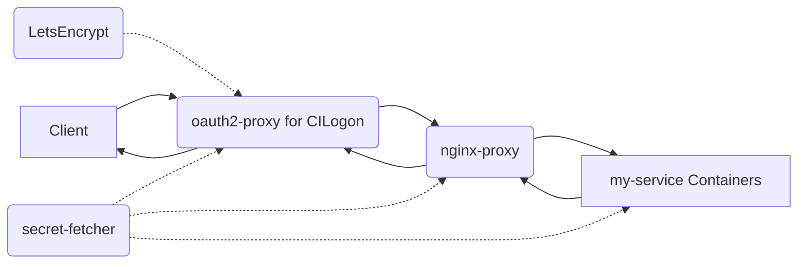

# Adding and maintaining web (and other) services in `braingeneers` infrastructure

## Basic usage:
Prerequisite: Download your personal (or service account) 
kubeconfig file from the cluster, place it in `~/.kube/config`. 
Run `kubectl get nodes` to verify that you can connect to the cluster, you
should see a list of cluster nodes.

Log into `braingeneers.gi.ucsc.edu`, see the [permissions page](https://github.com/braingeneers/wiki/blob/main/shared/permissions.md)
for access, then clone the repo into your home directory on `braingeneers` server as shown below.

```bash
# clone the repo
git clone git@github.com:braingeneers/mission_control.git
cd mission_control
```

## Manage individual services

You can also start and stop a single services, this is the normal case so you don't 
interfere with other running services, it's perfectly safe to do this while other services are running:

The name `my_service` is defined in the `docker-compose.yaml` file under `services:`
for example `mqtt`, `slack-bridge`, etc. are services in the `docker-compose.yaml` file 

```bash
# Stop (remove) a specific service
docker compose rm -sf my_service

# Pull the latest image for a specific service
docker compose pull my_service

# Start a specific service in the background (removed -d, detached, to see logs in the foreground, useful during testing)
docker compose up -d my_service

# See a list of all braingeneers service names (these are defined in the docker-compose.yaml file but can be quickly listed with a double tab)
docker compose up -d <tab><tab>

# See logs for a specific service
docker compose logs my_service

# See process status for all services
docker compose ps
```

## Manaing all services

This should only be done when the server is rebooted, under normal conditions you will be managing individual services as describe above.

```bash
# Pull latest version of all services
docker compose pull

# Start all services
docker compose up -d

# Stop all services
docker compose down
``` 

## How to Add a New Service

### Step 1: Clone the Repository

Clone the repository where our Docker Compose configuration resides (assuming GitHub/SSH keys configured).

```bash
git clone git@github.com:braingeneers/mission_control.git
```

### Step 2: Edit the Docker Compose File

Open the `docker-compose.yaml` file located in the `mission_control` directory in a text editor.

#### Adding a New Service

Add a new service definition for your container under the `services` section, similar to the existing services. Here is an example service you can start with:

```yaml
  # Describe your service in comments and let other people know who manages it
  your-service-name:                                                 # give your service a meaningful name, replace "your-service-name" with something meaningful like "supervisualizer"
    image: jwilder/whoami:latest                                     # your docker image name as hosted on Docker Hub (or other image hosting service)
    expose:
      - "8000"                                                       # the port(s) that your service is listening on inside your container
    environment:
      VIRTUAL_HOST: "your-service-name.braingeneers.gi.ucsc.edu"     # choose an appropriate domain name for your service, for example: your-service-name.braingeneers.gi.ucsc.edu
      VIRTUAL_PORT: "8000"                                           # same as what you listed in expose
      LETSENCRYPT_HOST: "your-service-name.braingeneers.gi.ucsc.edu" # same as VIRTUAL_HOST
      LETSENCRYPT_EMAIL: "braingeneers-admins-group@ucsc.edu"        # don't change this
    networks:
      - braingeneers-net                                             # don't change this
```

#### Setting the Virtual Host and LetsEncrypt environment variables

The `VIRTUAL_HOST` & `LETSENCRYPT_HOST` environment variables in your service's definition determines the subdomain your service will be accessible from. For instance, if `VIRTUAL_HOST` is set to `my-service`, your service will be accessible from `https://my-service.braingeneers.gi.ucsc.edu`. You can choose any valid hostname under the braingeneers.gi.ucsc.edu domain. The `VIRTUAL_PORT` defines what port your service listens to, any port is acceptable, you will not use the port when accessing your service, that's only used internally.

### Configuring Shared Secrets

If your service requires access to shared secrets, add a volume mount from the shared secrets volume. The secrets will be available in the following directory structure:

```text
/secrets/
  ├── prp-s3-credentials/
  │   └── credentials
  └── other-k8s-secret/
      └── other-files
```

You can add the following to your yaml to add this volume:

```
    volumes:
      - secrets:/secrets
    depends_on:
      secret-fetcher:
        condition: service_healthy
```

#### Using entrypoint-secrets-setup.sh

This is an advanced option.

The `entrypoint-secrets-setup.sh` script wraps the original entrypoint and allows copying files from the dynamic secrets volume to the correct location, as well as exporting environment variables from a specified file. Include this script in the service definition as shown in the example below if you need credentials files moved to the proper location, or environment variables set before launching your process.

Note the use of one or more `--copy` (or `--env`) commands which are processed 
by `entrypoint-secrets-setup.sh` to copy files to the correct location. 
You may use the `--env` option followed by the path to an 
environment file to export variables defined within that file into the 
environment.

Example of `--env` usage:

```bash
--env /secrets/k8s-secret-name/mysecrets.env
```

The above line will export all key-value pairs 
defined in `/secrets/k8s-secret-name/mysecrets.env` as environment 
variables, excluding lines starting with `#`. See the [wiki permissions page](https://github.com/braingeneers/wiki/blob/main/shared/permissions.md) 
on how to maintain kubernetes namespace secrets.

After processing the --copy and --env options, your original entrypoint command is executed with its arguments.

```yaml
services:
  your-service:
    image: your-image:latest
    entrypoint: /secrets/entrypoint-secrets-setup.sh
    command:
      - "--copy"
      - "/secrets/prp-s3-credentials/credentials:/root/.aws/credentials"
      - "--copy"
      - "/secrets/other-k8s-secret/other-files:/path/to/other/files"
      - "original-entrypoint-command"
      - "arg1"
      - "arg2"
    environment:
      VIRTUAL_HOST: "your-service.braingeneers.gi.ucsc.edu"
      VIRTUAL_PORT: "8000"
      LETSENCRYPT_HOST: "your-service.braingeneers.gi.ucsc.edu"
      LETSENCRYPT_EMAIL: "braingeneers-admins-group@ucsc.edu"

    # This section adds the secrets volume to your service, secrets are stored in-memory so they must depend on the
    # secret-fetcher service which populates that volume at startup.
    volumes:
      - secrets:/secrets
    depends_on:
      secret-fetcher:
        condition: service_healthy
```

Use the `--env` option in combination with the `--copy` option as needed to set up the environment for your containerized application.

### Commit the Changes

After verifying your service works correctly, commit the changes to the `docker-compose.yaml` file back to the `mission_control` repository.

## An Overview of Our Infrastructure

This section describes the automatic service discovery, automatic SSL certificate management, and automatic authentication provided.

A reverse proxy is a type of server that retrieves resources on behalf of a client from one or more servers. These resources are then returned to the client as though they originated from the reverse proxy itself. In our infrastructure, we use a multi-service Docker Compose setup, which includes two reverse proxy's (for authentication and for routing to different containers) and a shared secrets fetcher.

## OAuth2 Proxy for CILogon
The oauth2-proxy is an integral part of our Docker Compose setup, providing a unified interface for OAuth2 authentication via the CILogon service. It intercepts all incoming requests, gating access to our web services by redirecting unauthenticated users to CILogon for login.

Upon successful login, the user is redirected back to the oauth2-proxy, which in turn forwards the original request to the appropriate service, appending HTTP headers with authenticated user's information. This OAuth2 flow is completely handled by the oauth2-proxy, relieving individual services from managing this process.

This setup ensures that all requests to our services are authenticated, providing a secure and efficient method of managing user access in our infrastructure.

## Nginx Reverse Proxy
The `nginx-proxy` is a Docker container running Nginx and `docker-gen`. `docker-gen` generates reverse proxy configurations for Nginx and reloads Nginx when containers are started and stopped. This setup allows us to route incoming requests to different Docker containers (our services), each possibly running a different application, all on the same host machine.

## Shared Secrets Fetcher
The `secret-fetcher` service is a special Docker container that fetches shared secrets from a Kubernetes secret store. It does this on behalf of the other services running in the same Docker Compose setup. The secrets are retrieved when the services are started and stored in an in-memory volume accessible to all services. This ensures that each service has access to the same secrets without requiring them to retrieve the secrets individually. The only requirement is that the user running the Docker Compose stack has access to the Kubernetes namespace containing the secrets.

## Let's Encrypt for SSL Certificates

The LetsEncrypt container automates the creation and renewal of SSL certificates used by the oauth2-proxy. It communicates with the Let's Encrypt service to generate valid certificates for the domains specified via environment variables. The generated SSL certificates are stored in a shared volume and used by the oauth2-proxy to secure the client communication via HTTPS. This streamlines the management of our SSL certificates and enhances the security of our user-facing services.

## Best Practices

To ensure security and maintainability:

1. The services are designed to be stateless except for the `~/.kube/config` requirement to retrieve the secrets.
2. Services can rely on the Kubernetes secrets and can access any state files via our standard S3 service at `s3://braingeneers/` or other buckets.
3. Services can cache files on the host OS, such as the generated certificates, but should be able to start cleanly if those files are lost. This could happen occasionally, but not regularly.

The following diagram shows the process:


