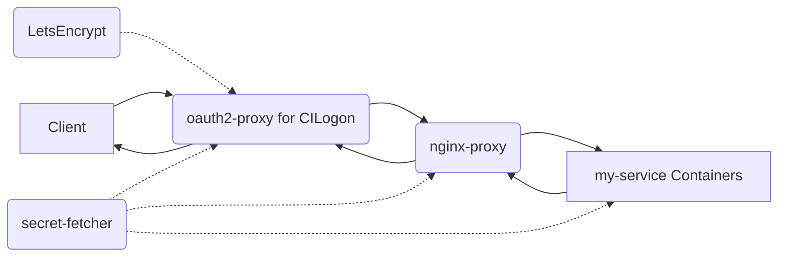

# Adding and maintaining web (and other) services in `braingeneers` infrastructure

## Basic usage:
Prerequisite: Download your personal (or service account) 
kubeconfig file from the cluster, place it in `~/.kube/config`. 
Run `kubectl get nodes` to verify that you can connect to the cluster, you
should see a list of cluster nodes.

Starting/stopping all services:

```bash
# clone the repo
git clone git@github.com:braingeneers/mission_control.git
cd mission_control

# start all services
docker compose up -d
```

If you need to pull a newer image version, run pull before starting the services as above:
```bash
docker compose pull
``` 

You can also start and stop just a single services which is useful during testing so you don't 
interfere with other running services, it's perfectly safe to do this while other services are running:

The name `my_service` is defined in the docker-compose.yaml file under `services:`
for example mqtt, slack-bridge, etc. are services in the docker-compose.yaml file 

```bash
# Stop (remove) a specific service
docker compose rm -sf my_service

# Pull the latest image for a specific service
docker compose pull my_service

# Start a specific service in the background (removed -d, detached, to see logs in the foreground, useful during testing)
docker compose up -d my_service

# See a list of all braingeneers service names (these are defined in the docker-compose.yaml file but can be quickly listed with a double tab)
docker compose up -d <tab><tab>

# See logs for a specific service
docker compose logs my_service

# See process status for all services
docker compose ps
```

## An Overview of Our Infrastructure

Importantly you can add a service to our infrastructure without updating any of the configurations described here.

A reverse proxy is a type of server that retrieves resources on behalf of a client from one or more servers. These resources are then returned to the client as though they originated from the reverse proxy itself. In our infrastructure, we use a multi-service Docker Compose setup, which includes two reverse proxy's (for authentication and for routing to different containers) and a shared secrets fetcher.

## OAuth2 Proxy for CILogon
The oauth2-proxy is an integral part of our Docker Compose setup, providing a unified interface for OAuth2 authentication via the CILogon service. It intercepts all incoming requests, gating access to our web services by redirecting unauthenticated users to CILogon for login.

Upon successful login, the user is redirected back to the oauth2-proxy, which in turn forwards the original request to the appropriate service, appending HTTP headers with authenticated user's information. This OAuth2 flow is completely handled by the oauth2-proxy, relieving individual services from managing this process.

This setup ensures that all requests to our services are authenticated, providing a secure and efficient method of managing user access in our infrastructure.

## Nginx Reverse Proxy
The `nginx-proxy` is a Docker container running Nginx and `docker-gen`. `docker-gen` generates reverse proxy configurations for Nginx and reloads Nginx when containers are started and stopped. This setup allows us to route incoming requests to different Docker containers (our services), each possibly running a different application, all on the same host machine.

## Shared Secrets Fetcher
The `secret-fetcher` service is a special Docker container that fetches shared secrets from a Kubernetes secret store. It does this on behalf of the other services running in the same Docker Compose setup. The secrets are retrieved when the services are started and stored in an in-memory volume accessible to all services. This ensures that each service has access to the same secrets without requiring them to retrieve the secrets individually. The only requirement is that the user running the Docker Compose stack has access to the Kubernetes namespace containing the secrets.

## Let's Encrypt for SSL Certificates

The LetsEncrypt container automates the creation and renewal of SSL certificates used by the oauth2-proxy. It communicates with the Let's Encrypt service to generate valid certificates for the domains specified via environment variables. The generated SSL certificates are stored in a shared volume and used by the oauth2-proxy to secure the client communication via HTTPS. This streamlines the management of our SSL certificates and enhances the security of our user-facing services.

## Best Practices

To ensure security and maintainability:

1. The services are designed to be stateless except for the `~/.kube/config` requirement to retrieve the secrets.
2. Services can rely on the Kubernetes secrets and can access any state files via our standard S3 service at `s3://braingeneers/` or other buckets.
3. Services can cache files on the host OS, such as the generated certificates, but should be able to start cleanly if those files are lost. This could happen occasionally, but not regularly.

The following diagram shows the process:



# How to Add a New Service to the Nginx Reverse Proxy Configuration with Shared Secrets

## Procedure

1. Clone the repository where our Docker Compose configuration resides (assuming GitHub/SSH keys configured).

```bash
git clone git@github.com:braingeneers/mission_control.git
```

2. Edit the Docker Compose file: Open the `docker-compose.yaml` file located in the `mission_control` directory in a text editor. Add a new service definition for your container under the `services` section, similar to the existing services.
  - Note: The `VIRTUAL_HOST` environment variable in your service's definition determines the subdomain your service will be accessible from. For instance, if `VIRTUAL_HOST` is set to `my-service`, your service will be accessible from `https://my-service.braingeneers.gi.ucsc.edu`.
  - Remember to also add a volume mount from the shared secrets volume to your service if it requires access to the shared secrets. The secrets will be available in the /secrets directory in your service's file system.

3. Remember to also add a volume mount from the shared `secrets` volume to your service if it requires access to the shared secrets. The secrets will be available in the `/secrets` directory in your service's file system.

4. After you've made your changes, save the `docker-compose.yaml` file and exit the text editor.

5. Restart the Docker Compose stack by running the following command in the directory where your `docker-compose.yaml` file is located:

```bash
docker compose up -d
```

6. This will stop and recreate the services defined in the Docker Compose file, including your newly added service.

7. After verifying your service works correctly, commit the changes to the `docker-compose.yaml` file back to the `mission_control` repository.

```bash
git commit -am "Added my-service to Docker Compose configuration"
git push
```
