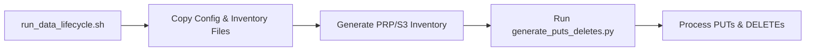

# Data Lifecycle Management Documentation

This document provides an overview of the data lifecycle management scripts and configuration file used in the Braingeneers data lifecycle process. The process consists of three main components:

1. A Bash script (`run_data_lifecycle.sh`) that handles the main operations of copying files, generating inventory, and running the data lifecycle Python script.

2. A Python script (`generate_puts_deletes.py`) that generates lists of files to be PUT and DELETE based on the inventories of PRP/S3 and AWS/Glacier/S3.

3. A YAML configuration file (`data-lifecycle.yaml`) that holds various parameters and paths used in the process.

## run_data_lifecycle.sh

This Bash script is responsible for performing the data lifecycle process. It primarily does the following:

1. Copies configuration and AWS inventory files locally and to PRP/S3.

2. Generates a local inventory of files from PRP/S3 using `aws` command-line and copies the generated inventory file to PRP/S3.

3. Invokes `generate_puts_deletes.py` Python script to generate lists of files for PUT and DELETE operations based on the local and AWS inventories.

4. Processes PUT and DELETE operations using `awscli`.

## generate_puts_deletes.py

This Python script generates lists of files for PUT and DELETE operations based on the provided PRP/S3 and AWS/Glacier/S3 inventory files. The script:

1. Loads the configuration file and inventory files.

2. Applies last modified date updates based on the configuration.

3. Determines the expiration date for files based on the configuration.

4. Generates PUT and DELETE lists based on inventories and the expiration date.

5. Outputs the PUT and DELETE lists.

## data-lifecycle.yaml

This YAML file stores the configuration used in the data lifecycle management process. It includes:

1. AWS S3 Glacier configuration: Contains the AWS S3 Glacier bucket name and inventory file path.

2. Deletion parameters: Contains the length of time (in days) before files are deleted by default.

3. Backup parameters: Contains paths to include in the backup, directories for atomic operations, and paths for extending the delete date.

## Flowchart

The flow of the data lifecycle process is as follows:



1. `run_data_lifecycle.sh`: Initiates the process.

2. Copy Config & Inventory Files: Copies configuration and AWS inventory files both locally and to PRP/S3.

3. Generate PRP/S3 Inventory: Generates a local inventory of the files in PRP/S3 and copies the result back to PRP/S3.

4. Run `generate_puts_deletes.py`: The Python script is invoked to generate lists of files for PUT and DELETE operations based on the local and AWS inventories.

5. Process PUTs & DELETEs: The PUT and DELETE operations are processed using `awscli`.

Remember that any change in the base scripts or configuration file might affect the data lifecycle process, so they should be updated with caution.

This document provides a general understanding of how the data lifecycle management process is performed. For more specific information, please refer to the comments in the scripts and configuration file.

## Software architecture

This sections is for future maintainers of the data-lifecycle. It explains each of the stages that the data-lifecycle process goes through (stage 0 through 4).

- `run_data_lifecycle.sh` - Entrypoint to the data-lifecycle, running this script will perform a full backup of everything defined in `data-lifecycle.yaml` to AWS Glacier. This script runs each of the stage0 through stage4 scripts.
- `stage0_prep_environment_vars.sh` - Sets up environment variables.
- `stage1_prep_inventory_files.sh` - Downloads the most recent AWS Glacier inventory CSV, `glacier_inventory.csv.gz`, and stores it on the nrp. This contains a full list of what we have currently on AWS Glacier.
- `stage2_generate_nrp_inventory.sh` - This actively scans the NRP (which will take some time). A corresponding CSV is created, `local_inventory.csv.gz` and stored in our S3 bucket with the `glacier_inventory.csv.gz`.
- `stage3_generate_puts_deletes.sh` - Does a set diff between the `glacier_inventory.csv.gz` and `local_inventory.csv.gz`, accounting for atomic directories defined in `data-lifecycle.yaml` and generates a list of files that need to be uploaded, `puts.txt`, files that should be deleted from the NRP `deletes.txt`, and a list of notifications that should be sent for files or atomic folders in `notifications.txt`.
- `stage4_process_puts_deletes.sh` - Performs the upload and delete processes from `puts.txt` and `deletes.txt`.

Example of `glacier_inventory.csv`:

```text
$ head glacier_inventory.csv 
"braingeneers-backups-glacier","braingeneers/imaging/2020-02-07-fluidics-imaging-2/images/2020-02-19T13:33:38/cameraC42/3.jpg","2227239","2023-06-21T19:28:41.000Z","DEEP_ARCHIVE"
"braingeneers-backups-glacier","braingeneers/imaging/2020-02-07-fluidics-imaging-2/images/2020-02-19T13:33:38/cameraC42/4.jpg","2188205","2023-06-21T19:28:41.000Z","DEEP_ARCHIVE"
"braingeneers-backups-glacier","braingeneers/imaging/2020-02-07-fluidics-imaging-2/images/2020-02-19T13:33:38/cameraC42/5.jpg","2186082","2023-06-21T19:28:41.000Z","DEEP_ARCHIVE"
```

Example of `local_inventory.csv.gz`:

```text
UNKNOWN_DATE,"s3://braingeneers/archive/.ingest.py.swo"
UNKNOWN_DATE,"s3://braingeneers/archive/.ingest.py.swp"
UNKNOWN_DATE,"s3://braingeneers/archive//images/2-Incubator-2019-12-04/manifest.json"
```