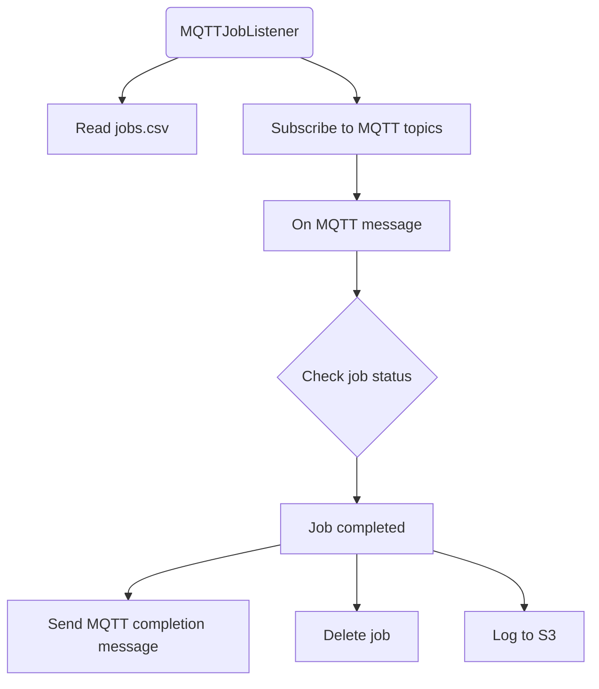

# MQTT Job Listener Documentation

## Introduction

This application is a Kubernetes job scheduler that listens for specific MQTT events. When an event occurs, it triggers the Kubernetes job specified for that event. The application is designed to be flexible, allowing users to add new jobs or modify existing ones by updating a CSV file hosted on Amazon S3.

## How to Schedule a New Job

To schedule a new job based on an MQTT message:

1. Create a row in the CSV file hosted at `s3://braingeneers/services/jobs.csv` using the following column headers:

    - `job_name`: The name of your job. This should be unique.
    - `mqtt_topic`: The MQTT topic that triggers the job.
    - `image`: The docker image to be used.
    - `cpu_request`, `memory_request`, `gpu`, `disk_request`: Hardware resources to request for the job.
    - `cpu_limit`, `memory_limit`, `disk_limit`: Maximum hardware resources for the job.

2. Upload the updated CSV file back to `s3://braingeneers/services/jobs.csv`.

When the MQTT Job Listener receives a message on the MQTT topic specified in the `mqtt_topic` column, it will schedule the corresponding Kubernetes job.

## How to Chain Jobs

You can chain jobs together such that the completion of one job triggers the next job. This is done by publishing an MQTT message upon job completion, which in turn can be used to trigger another job.

The MQTT Job Listener automatically sends a message on the `services/mqtt_job_listener/job_complete/{job_name}` topic when a job completes. To chain a job to this completion event, simply set the `mqtt_topic` for the next job to the appropriate job completion topic.

## Software Architecture

The MQTT Job Listener is implemented in Python and is divided into two primary classes:

- `K8sJobCreator`: Responsible for creating and managing Kubernetes jobs.
- `MQTTJobListener`: Listens for MQTT messages and triggers the corresponding Kubernetes jobs.



## Administration and Maintenance

The application runs as a Docker process on our server. It's included in the standard Docker compose script, which can be found in the Mission_Control repository.

### Updating the MQTT Job Listener

To update the MQTT Job Listener, modify the source code and rebuild the Docker image. The updated image should then be deployed via the Docker compose script.

### Error Handling

Errors and exceptions during job execution are logged and can be inspected for troubleshooting. It's important to regularly check these logs to ensure the application is functioning correctly.

## Best Practices for Running Parallel Jobs

When running parallel jobs using the `job-launcher` service, there are several best practices you should follow to ensure efficient and accurate processing.

### Using the Message Broker Queue

To distribute tasks across different pods or servers, you should use the `MessageBroker.get_queue('named-queue')` method. This method will return a queue object that you can use to manage tasks. The 'named-queue' parameter should be a unique string that is agreed upon between the initialization and worker jobs. This queue uses the standard Python `queue.Queue` interface, which ensures compatibility and ease of use.

For example:

```python
from braingeneers.iot import messaging

mb = messaging.MessageBroker()
queue = mb.get_queue('unique-queue-name')  # Replace 'unique-queue-name' with your unique queue name

# Add tasks to the queue
queue.put('my-task-1')
queue.put('my-task-2')
```

### Using an Initialization Job

To populate the queue with tasks, you can define an initialization job in the `jobs.csv` file. This job should have a parallelism of 1 to prevent race conditions. This job is responsible for populating the queue with tasks using the unique queue name agreed upon.

Here's an example of what an initialization job might look like in the CSV file:

```csv
job_name,image,mqtt_topic,cpu_request,cpu_limit,memory_request,memory_limit,gpu,disk_request,disk_limit,parallelism
init-job,braingeneers/job-init:latest,experiments/init-job,1,2,1Gi,2Gi,0,10Gi,20Gi,1
```

In the job script, you might have code similar to the following to populate the queue with tasks:

```python
queue = mb.get_queue('unique-queue-name')  # Use the same unique queue name here
for i in range(1000):
    queue.put(f'task-{i}')
```

### Using a Processing Job

A second job, or processing job, can be defined to process the tasks populated by the initialization job. This job should be set to trigger on the completion of the initialization job. The MQTT topic for this could be something like `services/mqtt_job_listener/job_complete/init-job`. 

The processing job should have a higher parallelism set, such as 50, to allow for multiple instances to run concurrently and process tasks in parallel. Here's an example of what a processing job might look like in the CSV file:

```csv
job_name,image,mqtt_topic,cpu_request,cpu_limit,memory_request,memory_limit,gpu,disk_request,disk_limit,parallelism
init-job,braingeneers/job-init:latest,experiments/init-job,1,2,1Gi,2Gi,0,10Gi,20Gi,1
processing-job,braingeneers/job-processing:latest,services/mqtt_job_listener/job_complete/init-job,1,2,1Gi,2Gi,0,10Gi,20Gi,50
```

In the script for the processing job, you might have code similar to the following:

```python
queue = mb.get_queue('unique-queue-name')  # Use the same unique queue name here

while not queue.empty():
    task = queue.get()
    # process the task here
    print(f'Processing {task}')
```

This script will loop through the tasks in the queue, process them, and then exit successfully when the queue is empty.

Remember, the key to successfully running parallel jobs using the `job-launcher` service is to carefully manage tasks using the provided queue and to set the appropriate level of parallelism for each job. The unique queue name used by both the initialization and worker jobs is vital for ensuring that tasks are correctly shared and processed.
## Conclusion

The MQTT Job Listener provides a robust, flexible way to automate Kubernetes job scheduling based on MQTT events. By updating a simple CSV file, you can easily configure and chain together complex job sequences to automate your workflow.

Please review the [Mission_Control repository](https://github.com/Braingeneers/Mission_Control) for more detailed administrative instructions and contact the Braingeneers team for any additional assistance.

Remember, this documentation is for adding a job to be scheduled based on an MQTT message. In case of any updates or modifications, you may need to refer to this document. Administrative and software architecture details are included at the end of the document for your reference.
