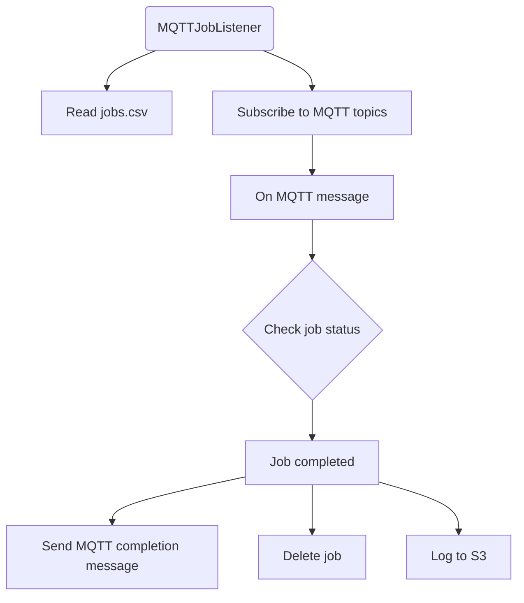

# MQTT Job Listener Documentation

## Introduction

This application is a Kubernetes job scheduler that listens for specific MQTT events. When an event occurs, it triggers the Kubernetes job specified for that event. The application is designed to be flexible, allowing users to add new jobs or modify existing ones by updating a CSV file hosted on Amazon S3.

## How to Schedule a New Job

To schedule a new job based on an MQTT message:

1. Create a row in the CSV file hosted at `s3://braingeneers/services/jobs.csv` using the following column headers:

    - `job_name`: The name of your job. This should be unique.
    - `mqtt_topic`: The MQTT topic that triggers the job.
    - `image`: The docker image to be used.
    - `cpu_request`, `memory_request`, `gpu`, `disk_request`: Hardware resources to request for the job.
    - `cpu_limit`, `memory_limit`, `disk_limit`: Maximum hardware resources for the job.

2. Upload the updated CSV file back to `s3://braingeneers/services/jobs.csv`.

When the MQTT Job Listener receives a message on the MQTT topic specified in the `mqtt_topic` column, it will schedule the corresponding Kubernetes job.

## How to Chain Jobs

You can chain jobs together such that the completion of one job triggers the next job. This is done by publishing an MQTT message upon job completion, which in turn can be used to trigger another job.

The MQTT Job Listener automatically sends a message on the `services/mqtt_job_listener/job_complete/{job_name}` topic when a job completes. To chain a job to this completion event, simply set the `mqtt_topic` for the next job to the appropriate job completion topic.

## Software Architecture

The MQTT Job Listener is implemented in Python and is divided into two primary classes:

- `K8sJobCreator`: Responsible for creating and managing Kubernetes jobs.
- `MQTTJobListener`: Listens for MQTT messages and triggers the corresponding Kubernetes jobs.

## Administration and Maintenance

The application runs as a Docker process on our server. It's included in the standard Docker compose script, which can be found in the Mission_Control repository.

### Updating the MQTT Job Listener

To update the MQTT Job Listener, modify the source code and rebuild the Docker image. The updated image should then be deployed via the Docker compose script.

### Error Handling

Errors and exceptions during job execution are logged and can be inspected for troubleshooting. It's important to regularly check these logs to ensure the application is functioning correctly.

## Conclusion

The MQTT Job Listener provides a robust, flexible way to automate Kubernetes job scheduling based on MQTT events. By updating a simple CSV file, you can easily configure and chain together complex job sequences to automate your workflow.

Please review the [Mission_Control repository](https://github.com/Braingeneers/Mission_Control) for more detailed administrative instructions and contact the Braingeneers team for any additional assistance.

Remember, this documentation is for adding a job to be scheduled based on an MQTT message. In case of any updates or modifications, you may need to refer to this document. Administrative and software architecture details are included at the end of the document for your reference.
